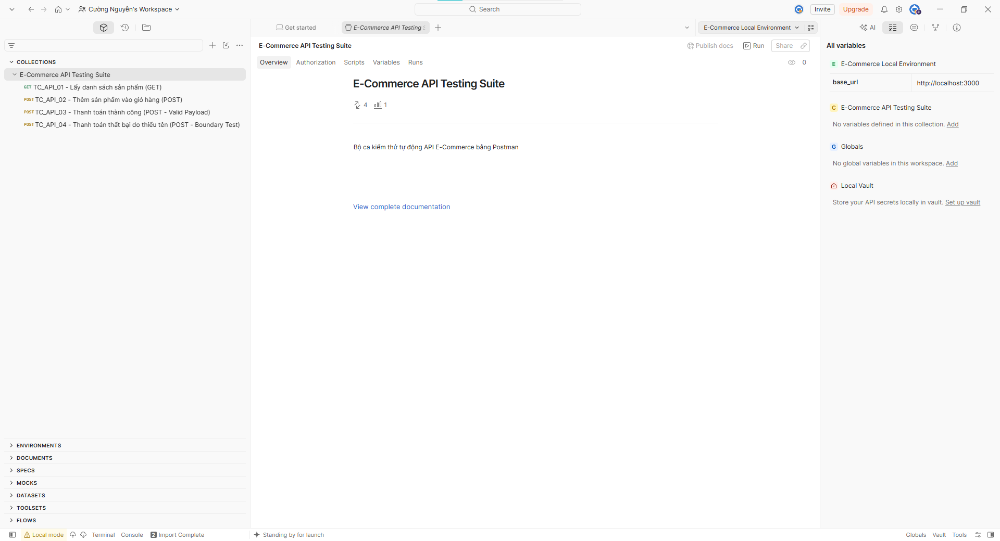
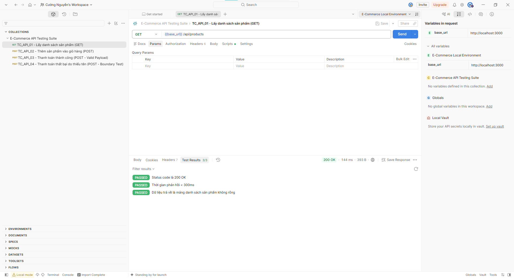
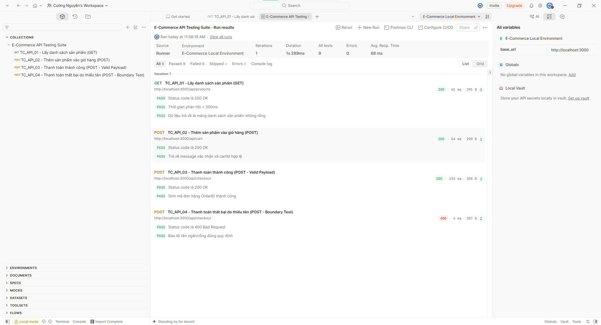
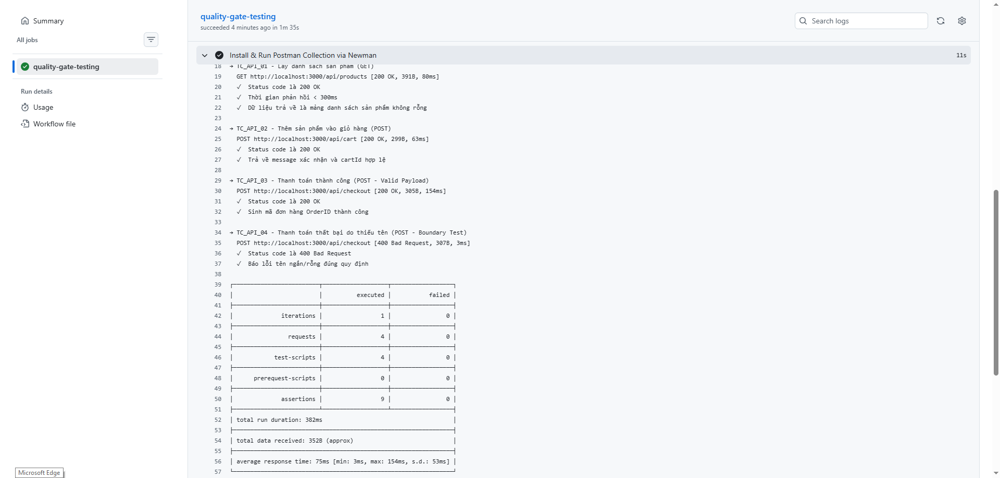

# BÁO CÁO THỰC HÀNH: KIỂM THỬ API BẰNG POSTMAN & TÍCH HỢP CI/CD PIPELINE

## 📋 THÔNG TIN BÀI NỘP
- **Môn học:** Đánh giá và kiểm định chất lượng phần mềm
- **Chủ đề:** Kiểm thử tự động API bằng Postman & Tích hợp vào quy trình CI/CD
- **Dự án thực nghiệm:** Hệ thống E-Commerce Web Application (Node.js & Express)

---

## 📚 1. TÀI LIỆU THAM KHẢO & HỌC TẬP
1. **Video hướng dẫn chính:** [Postman Api Testing Tutorial for beginners - Codemify](https://www.youtube.com/watch?v=MFxk5BZulVU)
2. **Tài liệu tham khảo bổ sung:**
   - [Postman Official Documentation - Writing Tests](https://learning.postman.com/docs/writing-scripts/test-scripts/)
   - [Newman CLI Runner Integration Guide](https://learning.postman.com/docs/collections/using-newman-cli/running-collections-with-newman/)

---

## 🎯 2. MA TRẬN CA KIỂM THỬ API (API TEST MATRIX)

| Mã Ca Test | Tên API Endpoint | Phương Thức | Mô Tả Kịch Bản | Kiểm Tra (Assertions) | Trạng Thái Mọng Đợi |
|---|---|---|---|---|---|
| **TC_API_01** | `/api/products` | `GET` | Lấy danh sách sản phẩm | Code 200, Thời gian < 300ms, Mảng sản phẩm $>0$ | `200 OK` |
| **TC_API_02** | `/api/cart` | `POST` | Thêm sản phẩm vào giỏ | Code 200, Trả về `cartId` chuỗi | `200 OK` |
| **TC_API_03** | `/api/checkout` | `POST` | Thanh toán hợp lệ | Code 200, Trả về `orderId` chứa chuỗi `ORD_` | `200 OK` |
| **TC_API_04** | `/api/checkout` | `POST` | Tên ngắn/Rỗng (Boundary Test) | Code 400, Báo lỗi tên ngắn đúng quy định | `400 Bad Request` |

---

## 🖼️ 3. KẾT QUẢ THỰC THI & HÌNH ẢNH MINH HỌA

### 3.1 Cấu hình Collection và Environment trong Postman
Đã khởi tạo bộ Collection `E-Commerce API Testing Suite` kết nối với biến môi trường `{{base_url}} = http://localhost:3000`.



### 3.2 Kết quả thực thi từng Ca kiểm thử (Test Results)
Tất cả các ca kiểm thử API đều kiểm tra thành công danh sách phản hồi và độ trễ hệ thống.



### 3.3 Thực thi tự động bằng Postman Collection Runner
Chạy toàn bộ tập kịch bản thông qua Collection Runner ghi nhận 100% Pass Rate.



### 3.4 Kết quả tích hợp CI/CD Pipeline (Newman CLI trên GitHub Actions)
Công cụ Newman được tích hợp trực tiếp vào GitHub Actions Workflow tự động chạy kiểm thử API mỗi khi push code.



---

## 🛠️ 4. HƯỚNG DẪN TỰ CHẠY BỘ TEST

1. **Khởi động Server:**
   ```bash
   docker-compose up -d